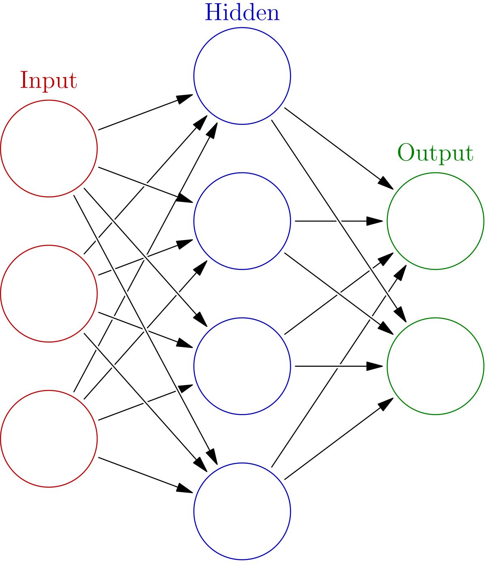
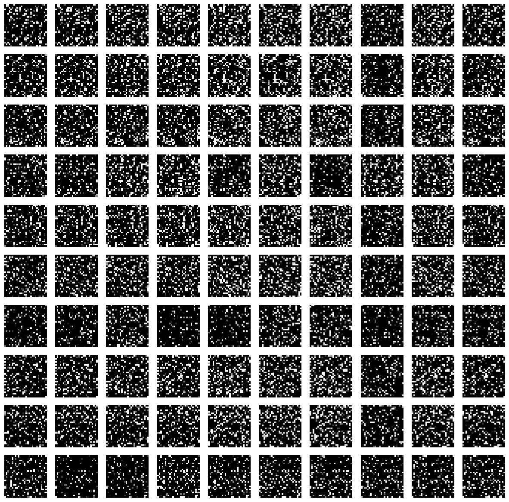

<!-- _paginate: skip -->

<!--_class: title -->
# PROPUESTA DE ESTRATEGIAS PARA REDUCIR EL FENÓMENO DE OLVIDO CATASTRÓFICO EN MODELOS DE CLASIFICACIÓN CON APRENDIZAJE CONTINUO

**Memorista**: Jesús Oyanedel
**Profesor Guía**: Dr. Claudio Torres
**Profesora Correferente**: Dra. Elizabeth Montero
**Profesora Correferente**: Dra. Raquel Pezoa

---
<!-- _paginate: skip -->
# Contenido

1. Introducción ilustrativa
2. Aprendizaje continuo
3. Olvido catastrófico
4. Estado del arte
5. Soluciones propuestas
6. Validación de las propuestas
7. Conclusiones

---
<!--_class: title -->
## Definiciones

---
# Definiciones
## Aprendizaje de máquinas

* Tarea $T$
* Experiencia $E$
* Métrica $P$
* Máquina $M$
---
# Definiciones
## Aprendizaje supervisado

* Datos $D$
* Dato de entrada $x$
* Dato de salida / etiqueta $y$
* Predicción / etiqueta predicha $\hat{y}$
* Función de pérdida $l(y, \hat{y})$
* Optimizador $g(M, l)$
---

# Definiciones
## Red Neuronal
* Conjunto de neuronas
* Capas: $L$
* Funciones de activación: $a$
* Salida: $o$
* Pesos / parámetros: $\theta$

---
<!--_class: title -->
## Aprendizaje Continuo

---
# Aprendizaje Continuo
## Aprendizaje Continuo

* Tareas $T = 1, 2, \dots, t, \dots$
* Experiencias $E = 1, 2, \dots, e, \dots$
* Métrica $P$
* Máquina $M$
---
# Aprendizaje Continuo
## ¿Por qué aprendizaje continuo?

* Variación de distribución de datos en el tiempo
* Optimización:
    * Tiempo
    * Energéticos (ML Sostenible)
    * Computacional
---
<!--_class: title -->
## Olvido catastrófico

---
# Olvido catastrófico
## ¿Qué es?

* Contexto
    * Aprendizaje continuo
    * Red neuronal
    * Retropropagación
* Tareas nuevas
* Métrica $P$ 📉
---
# Olvido catastrófico
## Dicotomía elasticidad-plasticidad
* Tradeoff entre aprender vs recordar

---
# Olvido catastrófico: métricas
## Accuracy

$$a_j = \frac{\text{TP}}{\text{TP} + \text{FP}}$$

## Average Accuracy
$$AA_k = \frac{1}{k} \cdot \sum_{j=1}^k a_{k, j}$$

---
# Olvido catastrófico: métricas
## Average Incremental Accuracy
$$AIA_k = \frac{1}{k} \cdot \sum_{i=1}^k AA_i$$

---
# Olvido catastrófico: métricas
## Backward Transfer
$$BWT_k = \frac{1}{k-1}\sum_{j=1}^{k-1}(a_{k,j} - a_{j,j})$$

## Forgetting Measure
$$f_{j,k} = \text{max}_{i \in \{1, \dots k-1\}} (a_{i,j} - a_{k,j}), \forall j \leq k$$
$$FM_k = \frac{1}{k-1} \sum_{j=1}^{k-1} f_{j,k}$$

---
<!--_class: title -->
## Estado del arte

---
# Estado del arte
## ¿Qué se ha propuesto?

* Elastic Weight Consolidation (EWC)
* Gradient Episodic Memory (GEM)
* Incremental Classifier and Representation Learning (iCaRL)
* Learning without Forgetting (LwF)
* Maximally Interfered Retrieval (MIR)
* Orthogonal Gradient Descent (OGD)
* Entre otros...
---
<!--_class: title-->
## Soluciones propuestas

---
# Soluciones propuestas
## Propuesta 1

$$
\mathcal{L} =
\mathcal{L}_c

+ \lambda_1 \left\| \bm{u}\odot (\bm{\theta} - \bm{\theta}_A^*) \right\|_1

+ \lambda_2 \left\| (\bm{1 - u}) \odot (\bm{\theta} - \bm{\theta}_A^*) \right\|_2^2
$$

donde:

* $\bm{\theta}$: parámetros actuales de la red
* $\bm{\theta}_A^*$: parámetros de la red en la tarea anterior
* $u_i = 1$, si $\text{diag}(\mathcal{I}(\bm{\theta}))_i \geq \mu$, en otro caso $0$

---
# Soluciones propuestas
## Propuesta 2

$$
\mathcal{L} =
\mathcal{L}_c

+ \lambda_1 \left\| \bm{s} \odot \bm{\theta} \right\|_1

+ \lambda_2 \left\| (\bm{1 - s}) \odot \bm{\theta} \right\|_2^2
$$

donde:

* $\bm{\theta}$: parámetros actuales de la red
* $s_i = 1$, si $\theta_i < \varepsilon$, en otro caso $0$

---
# Soluciones propuestas
## Propuesta 3

$$
\mathcal{L} =
\mathcal{L}_c

+ \lambda_e \left\| \bm{p}_A^* \odot (\bm{\theta} - \bm{\theta}_A^*) \right\|_1

+ \lambda_f \left\| (\bm{1 - p}) \odot \bm{\theta}\right\|_1
$$

donde:

* $\bm{\theta}$: parámetros actuales de la red
* $\bm{\theta}_A^*$: parámetros de la red en la tarea anterior
* $p_i = 1$, si $\theta_i > \varepsilon$, en otro caso $0$
* $\bm{p}_A^*$: $\bm{p}$ en la tarea anterior

---
<!--_class: title-->
## Validación de las propuestas

---
# Validación de las propuestas
## Conjunto de validación

---
# Validación de las propuestas
## Arquitectura base

* Red neuronal
* Entrada 28 x 28
* 2 Capas ocultas de 100 neuronas
* Capa de salida con 100 clases
---
# Validación de las propuestas
## Soluciones comparadas

* A-GEM / GEM
* Cumulative
* EWC
* LwF
* MIR
* Naive
* Propuesta 1 / 2 / 3
---
# Validación de las propuestas
## Comparación estándar

---
# Validación de las propuestas
## Métricas a comparar

* Accuracy por clase
* Forgetting Measure
* Tiempo de entrenamiento

## Tareas
* 10 Tareas
* 10 Clases por tareas
* 10 Experiencias
---
# Comparación estándar: Accuracy

---
# Comparación estándar: Accuracy
--
| Tarea       | 1            | 2            | 3            | 4            | 5            | 6            | 7            | 8            | 9            | 10           | General      |
|-------------|--------------|--------------|--------------|--------------|--------------|--------------|--------------|--------------|--------------|--------------|--------------|
| Baseline    | $0.928$      | $0.926$      | $0.928$      | $0.928$      | $0.929$      | $0.928$      | $0.924$      | $0.927$      | $0.931$      | $0.927$      | $0.928$      |
| AGEM        | $0.616$      | $0.577$      | $0.682$      | $0.702$      | $0.755$      | $0.806$      | $0.867$      | $0.898$      | $\bm{0.924}$ | $0.943$      | $\bm{0.777}$ |
| Cumulative  | $0.956$      | $0.956$      | $0.956$      | $0.954$      | $0.957$      | $0.955$      | $0.952$      | $0.952$      | $0.947$      | $0.942$      | $0.953$      |
| EWC         | $\bm{0.874}$ | $\bm{0.862}$ | $\bm{0.824}$ | $\bm{0.754}$ | $0.768$      | $0.642$      | $0.664$      | $0.649$      | $0.727$      | $0.924$      | $0.769$      |
| GEM         | $0.560$      | $0.484$      | $0.631$      | $0.499$      | $0.653$      | $0.684$      | $0.723$      | $0.689$      | $0.893$      | $0.942$      | $0.676$      |
| LwF         | $0.566$      | $0.588$      | $0.664$      | $0.610$      | $\bm{0.786}$ | $\bm{0.812}$ | $0.853$      | $0.896$      | $0.915$      | $0.941$      | $0.763$      |
| MIR         | $0.563$      | $0.540$      | $0.694$      | $0.675$      | $0.777$      | $0.784$      | $0.872$      | $\bm{0.905}$ | $0.919$      | $0.943$      | $0.767$      |
| Naive       | $0.558$      | $0.579$      | $0.681$      | $0.676$      | $0.785$      | $0.801$      | $0.874$      | $0.891$      | $0.920$      | $\bm{0.945}$ | $0.771$      |
| Propuesta 1 | $0.559$      | $0.575$      | $0.672$      | $0.663$      | $0.768$      | $0.777$      | $0.855$      | $0.901$      | $0.914$      | $0.943$      | $0.763$      |
| Propuesta 2 | $0.532$      | $0.531$      | $0.629$      | $0.629$      | $0.738$      | $0.807$      | $\bm{0.879}$ | $0.895$      | $\bm{0.924}$ | $0.944$      | $0.751$      |
| Propuesta 3 | $0.595$      | $0.675$      | $0.672$      | $0.739$      | $0.728$      | $0.735$      | $0.784$      | $0.814$      | $0.819$      | $0.842$      | $0.740$      |

---
# Comparación estándar: Tarea 1

---
# Comparación estándar: Tarea 8

---
# Comparación estándar: Forgetting

--
| Tarea       | 1            | 2            | 3            | 4            | 5            | 6            | 7            | 8            | 9            | Promedio por Tarea | Promedio por tarea ponderado |
|-------------|--------------|--------------|--------------|--------------|--------------|--------------|--------------|--------------|--------------|--------------------|------------------------------|
| AGEM        | $0.166$      | $0.159$      | $0.139$      | $0.095$      | $0.084$      | $0.082$      | $0.043$      | $0.033$      | $0.016$      | $0.091$            | $0.117$                      |
| Cumulative  | $-0.041$     | $-0.024$     | $-0.017$     | $-0.014$     | $-0.011$     | $-0.009$     | $-0.007$     | $-0.006$     | $-0.005$     | $-0.015$           | $-0.020$                     |
| EWC         | $\bm{0.036}$ | $\bm{0.049}$ | $0.078$      | $0.113$      | $0.101$      | $0.190$      | $0.190$      | $0.214$      | $0.201$      | $0.130$            | $0.098$                      |
| GEM         | $0.255$      | $0.225$      | $0.187$      | $0.227$      | $0.202$      | $0.143$      | $0.189$      | $0.228$      | $0.050$      | $0.189$            | $0.209$                      |
| LwF         | $0.170$      | $0.173$      | $0.127$      | $0.120$      | $0.071$      | $0.077$      | $0.051$      | $0.036$      | $0.026$      | $0.094$            | $0.121$                      |
| MIR         | $0.188$      | $0.199$      | $0.130$      | $0.105$      | $0.083$      | $0.087$      | $0.041$      | $0.028$      | $0.022$      | $0.098$            | $0.129$                      |
| Naive       | $0.196$      | $0.184$      | $0.120$      | $0.102$      | $0.073$      | $0.083$      | $0.044$      | $0.037$      | $0.022$      | $0.096$            | $0.125$                      |
| Propuesta 1 | $0.187$      | $0.175$      | $0.136$      | $0.106$      | $0.083$      | $0.091$      | $0.053$      | $0.031$      | $0.026$      | $0.099$            | $0.127$                      |
| Propuesta 2 | $0.207$      | $0.196$      | $0.160$      | $0.117$      | $0.105$      | $0.076$      | $0.038$      | $0.035$      | $\bm{0.018}$ | $0.106$            | $0.140$                      |
| Propuesta 3 | $0.134$      | $0.068$      | $\bm{0.072}$ | $\bm{0.045}$ | $\bm{0.050}$ | $\bm{0.049}$ | $\bm{0.036}$ | $\bm{0.027}$ | $0.032$      | $\bm{0.057}$       | $\bm{0.070}$                 |

---
# Comparación estándar: Tiempo de entrenamiento

---
# Validación de las propuestas
## Comparación por saturación de tareas

---
# Validación de las propuestas
## Métricas a comparar

* Accuracy por clase
* Forgetting measure

## Tareas
* 20 y 50 tareas
* 5 y 2 clases por tareas respectivamente
* 20 y 50 experiencias respectivamente
---
# Comparación por saturación de tareas: 20 - EWC

---
# Comparación por saturación de tareas: 20 - Naive

---
# Comparación por saturación de tareas: 20 - Prop 1

---
# Comparación por saturación de tareas: 20 - Prop 2

---
# Comparación por saturación de tareas: 20 - Prop 3

---
# Comparación por saturación de tareas: 20 - Métricas

| Métrica     | Accuracy     | Average Incremental Accuracy | Forgetting medio |
|-------------|--------------|------------------------------|------------------|
| EWC         | $0.581$      | $\bm{0.764}$                 | $0.245$          |
| Naive       | $0.552$      | $0.745$                      | $0.282$          |
| Propuesta 1 | $0.561$      | $0.754$                      | $0.272$          |
| Propuesta 2 | $0.546$      | $0.746$                      | $0.283$          |
| Propuesta 3 | $\bm{0.673}$ | $0.732$                      | $\bm{0.131}$     |

---
# Comparación por saturación de tareas: 50 - EWC

---
# Comparación por saturación de tareas: 50 - Naive

---
# Comparación por saturación de tareas: 50 - Prop 1

---
# Comparación por saturación de tareas: 50 - Prop 2

---
# Comparación por saturación de tareas: 50 - Prop 3

---
# Comparación por saturación de tareas: 50 - Métricas

| Métrica     | Accuracy     | Average Incremental Accuracy | Forgetting medio |
|-------------|--------------|------------------------------|------------------|
| EWC         | $0.357$      | $0.560$                      | $0.465$          |
| Naive       | $0.308$      | $0.543$                      | $0.521$          |
| Propuesta 1 | $0.303$      | $0.538$                      | $0.528$          |
| Propuesta 2 | $0.300$      | $0.528$                      | $0.537$          |
| Propuesta 3 | $\bm{0.474}$ | $\bm{0.625}$                 | $\bm{0.278}$     |

---

# Validación de las propuestas
## Comparación por saturación de reentrenamiento

---
# Validación de las propuestas
## Métricas a comparar

* Accuracy por clase
* Average Incremental Accuracy
* Forgetting measure

## Tareas
* 10 Tareas
* 10 Clases por tarea
* 50 Experiencias
---
# Comparación por saturación de reentrenamiento: EWC

---
# Comparación por saturación de reentrenamiento: Naive

---
# Comparación por saturación de reentrenamiento: Prop 3

---
# Comparación por saturación de reentrenmiento: Métricas

| Métrica     | Accuracy        | Forgetting medio |
|-------------|-----------------|------------------|
| EWC         | $0.836020$      | $0.140080$       |
| Naive       | $0.903870$      | $0.029109$       |
| Propuesta 3 | $\bm{0.906470}$ | $\bm{0.027804}$  |

---

<!--_class: title-->
## Conclusiones
---
# Conclusiones

* EWC
* Propuesta 3
* Resto de soluciones
---
# Conclusiones
## Trabajos futuros

* Dataset - Arquitectura
* Ensamblados
* Orden de clases
* Dirección unitaria en componentes de $\mathcal{L}$
* \+ comparaciones con soluciones
* XAI
---
## Gracias por su atención
---
<!--_class: title-->
## Anexos

